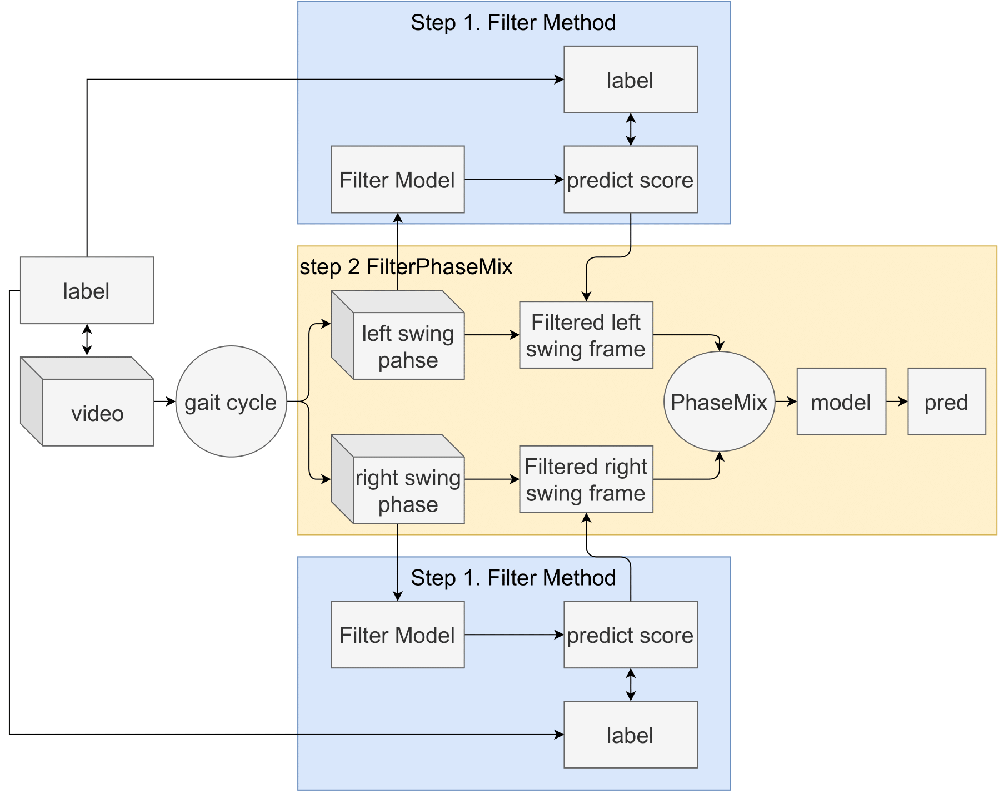

<div align="center">    
 
# FilterPhaseMix: A Periodic Motion Fusion Method with Filtered Features for Adult Spinal Deformity Classification
  
<!-- [](https://ieeexplore.ieee.org/document/10714330) -->

</div>
 


## Description

Human gait analysis is crucial for classifying gait impairments, such as adult spinal deformities. Recent deep learning approaches leverage video data to capture dynamic features like gait periodicity and symmetry. However, these methods often overlook key frame relationships within the gait cycle, potentially missing critical diagnostic information. To address this, we propose a filter method named FilterPhaseMix, which selects key frames based on the gait cycle and action dynamics, enhancing feature extraction for clinical relevance. Our experiments on a video dataset of 81 patients showed that the proposed method outperformed baseline approaches, achieving 74.55\% accuracy, 74.34\% precision, and a 74.18\% F1-score. By leveraging gait kinematics, the proposed filter method refines frame selection and enhances diagnosis with limited video data.

The main contributions of this paper are as follows:

1. We propose a **Filter Method** to identify key frames within the gait cycle, enhancing feature extraction.
2. We introduce a framework, **FilterPhaseMix**, which selects key frames and segments the gait cycle into different phases for improved disease diagnosis.

## Training Step

The traing and test step is shown as follows:



1. Step 1 **Filter Model**: The filter model is trained to select key frames based on the gait cycle and action dynamics.
2. Step 2 **Phasemix Model**: The phasemix model is trained to segment the gait cycle into different phases and classify the disease.

## Experimental Results

We compare the experimental results with the following models:

1. 3D CNN
2. PhaseMix + 3D CNN
3. FilterPhaseMix + 3D CNN
   a. Filter trained by left swing
   b. Filter trained by right swing
   c. Filter trained by whole
   d. Filter trained by mix (left swing and right swing)

## How to run

1. install dependencies

```bash
# clone project
git clone https://github.com/ChenKaiXuSan/Filter_PhaseMix_PyTorch/

# install project
cd Filter_PhaseMix_PyTorch/
pip install -e .
pip install -r requirements.txt
```

2. train the filter model

```bash
python -m project.filter_train.main
```

3. inference the data with pre-trained filter model.

```bash
python -m project.filter_score.main
```

This will generate the filtered score into target json file.

4. train and evaluate the phasemix model.

```bash
python -m project.phasemix_main
```

> 📓 All project suppported by hydra-core.

## Docker

We recommend using docker to build the training environment.

1. build the docker image

```bash
docker build -t filterphasemix .
```

2. run the docker container

```bash
docker run -it filterphasemix
```

3. go to the project folder and run the training step.
reference: [How to run](#how-to-run)

```bash
cd /workspace/Filter_PhaseMix_PyTorch
```

## Citation

The second version of this research project is available on [IEEE Access](https://ieeexplore.ieee.org/document/10714330).

```
@ARTICLE{10714330,
  author={Chen, Kaixu and Xu, Jiayi and Asada, Tomoyuki and Miura, Kousei and Sakashita, Kotaro and Sunami, Takahiro and Kadone, Hideki and Yamazaki, Masashi and Ienaga, Naoto and Kuroda, Yoshihiro},
  journal={IEEE Access},
  title={PhaseMix: A Periodic Motion Fusion Method for Adult Spinal Deformity Classification},
  year={2024},
  volume={12},
  number={},
  pages={152358-152376},
  keywords={Legged locomotion;Feature extraction;Accuracy;Human activity recognition;Reviews;Face recognition;Diseases;Deep learning;Cameras;Surgery;Deep learning;Medical services;Adult spinal deformity;deep learning;human action recognition;healthcare;gait posture;periodic motion;motion symmetry},
  doi={10.1109/ACCESS.2024.3479165}}
```

The first version of this research project is available on [Frontiners in Neuroscience](https://www.frontiersin.org/journals/neuroscience/articles/10.3389/fnins.2023.1278584/full).

```
@article{chen2023two,
  title={Two-stage video-based convolutional neural networks for adult spinal deformity classification},
  author={Chen, Kaixu and Asada, Tomoyuki and Ienaga, Naoto and Miura, Kousei and Sakashita, Kotaro and Sunami, Takahiro and Kadone, Hideki and Yamazaki, Masashi and Kuroda, Yoshihiro},
  journal={Frontiers in Neuroscience},
  volume={17},
  pages={1278584},
  year={2023},
  publisher={Frontiers Media SA}
}
```
